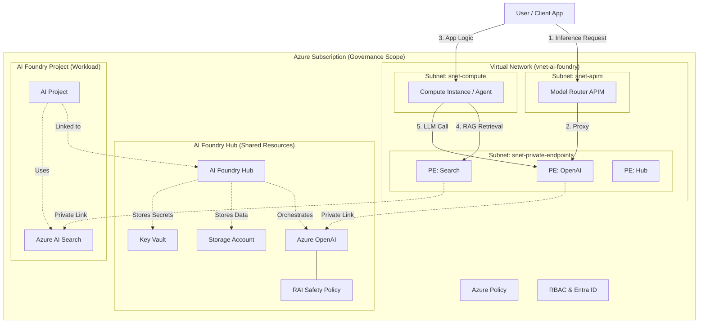
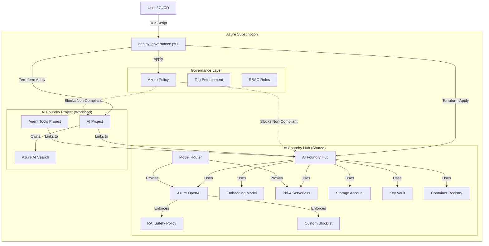

# AI Foundry Technical Architecture

**Context:** This document details the technical implementation of the Azure AI Foundry environment, including networking, RAG patterns, and automation logic.

---

## 1. Architecture Overview

The solution implements a **Hub-and-Spoke** model for AI services.
*   **Hub**: Centralized, shared resources (OpenAI, Storage, Key Vault, ACR) managed by the Platform Team.
*   **Spoke (Project)**: Application-specific resources (Search, Agent Tools) managed by App Teams.

### Runtime Architecture Diagram



### Deployment Architecture Diagram



> **Note on Model Router:** The current `model-router` Terraform module implements a simple pass-through policy. Advanced routing logic (e.g., round-robin, priority, failover) must be added to the APIM Policy XML in `iac/foundry/templates/model-router/main.tf`.

---

## 2. Networking & Security

**Status:** Implemented (Single VNET Hub-Spoke)

### Topology
*   **VNET:** `vnet-ai-foundry` (East US)
    *   **Reference:** `10.0.0.0/16` (Default for standalone/demo)
    *   **Enterprise:** In an ESLZ, this VNET acts as a **Spoke**. It should be assigned a smaller, non-overlapping CIDR (e.g., `/22` or `/24`) by your IPAM team. The `/16` size is excessive for most AI workloads and may conflict with Hub address spaces.
*   **Subnets:**
    *   `snet-private-endpoints` (Default: `10.0.1.0/24`): Dedicated for PaaS Private Endpoints.
    *   `snet-compute` (Default: `10.0.2.0/24`): Hosting subnet for AI Compute Instances.
    *   `snet-apim` (Default: `10.0.3.0/24`): Dedicated subnet for API Management (Internal Mode).

### Connectivity
All critical PaaS services have **Public Network Access disabled** (or restricted) and are accessed via **Private Endpoints**.

| Service | Private Endpoint | DNS Zone |
| :--- | :--- | :--- |
| **Azure OpenAI** | `{hub}-openai-pe` | `privatelink.openai.azure.com` |
| **Foundry Hub** | `{hub}-ws-pe` | `privatelink.api.azureml.ms` |
| **Storage (Blob)** | `{hub}-st-blob-pe` | `privatelink.blob.core.windows.net` |
| **Storage (File)** | `{hub}-st-file-pe` | `privatelink.file.core.windows.net` |
| **Key Vault** | `{hub}-kv-pe` | `privatelink.vaultcore.azure.net` |
| **AI Search** | `{project}-search-pe` | `privatelink.search.windows.net` |
| **Container Registry** | `{hub}-acr-pe` | `privatelink.azurecr.io` |
| **Notebooks** | N/A (via Hub) | `privatelink.notebooks.azure.net` |
| **Model Router (APIM)** | Internal VNET Injection | N/A (Uses Custom DNS) |

> **Note:** The reference Terraform implementation deploys APIM with the **Developer SKU** and **External** access to minimize cost and complexity during initial evaluation. For Production, you must switch to **Premium SKU** and configure `virtual_network_type = "Internal"` in `iac/foundry/templates/foundry-hub/apim.tf`.

### Traffic Flow
1.  **User -> Hub:** Users access the Foundry Portal. The Portal communicates with the Hub API via the public control plane (secured by Entra ID), but data plane operations (e.g., accessing storage, running flows) originate from the user's client or the Compute Instance.
2.  **Compute -> Storage/KeyVault:** Traffic originates from `snet-compute`, resolves the private IP via Private DNS, and travels over the Microsoft Backbone to the Private Endpoint in `snet-private-endpoints`.
3.  **RAG Ingestion:** Compute Instance reads raw files from Storage (Private), chunks them, sends to OpenAI for Embedding (Private), and writes to AI Search (Private).

### Enterprise Integration & Optimization

#### Network Address Optimization
To minimize IP address consumption in constrained enterprise environments:
*   **Subnet Sizing:** The reference implementation uses `/24` subnets for simplicity. In production, size subnets based on projected scale:
    *   `snet-private-endpoints`: Minimum `/26` (64 IPs) to accommodate PEs for Hub, OpenAI, Search (per project), and Storage.
    *   `snet-compute`: Minimum `/27` (32 IPs) if using Serverless Compute; larger if using persistent Compute Instances.
    *   `snet-apim`: Minimum `/27` (32 IPs) is required for APIM VNET integration. `/26` is recommended for production to support scaling.
*   **Private Endpoint Consolidation:** Use a shared "Connectivity Subscription" for Private Endpoints if IP space is extremely scarce, though this adds RBAC complexity.

#### Integration with Enterprise Landing Zones (ALZ)
This solution is designed to plug into an existing **Azure Landing Zone (ALZ)** Hub-and-Spoke network:
1.  **VNET Peering:** Peer `vnet-ai-foundry` with the Enterprise Hub VNET to allow on-premises connectivity via ExpressRoute/VPN.
2.  **DNS Resolution:**
    *   **Current:** Uses local Azure Private DNS Zones linked to the VNET.
    *   **Enterprise:** Configure the VNET to use the Enterprise Custom DNS servers. Forward DNS queries for `privatelink.*` zones to the Enterprise DNS resolvers to ensure on-premises clients can resolve AI services.
3.  **Firewall Inspection:** Route egress traffic (0.0.0.0/0) from `snet-compute` through the Enterprise Firewall (NVA) for data exfiltration protection.

### Public Access & Deployment Agents
*   **Current State:** `public_network_access_enabled = true` for core resources to facilitate deployment via standard runners.
*   **Production Recommendation:** Set to `false` and deploy **Self-Hosted Agents** inside the VNET.

---

## 3. Identity & Access Management (RBAC)

The solution uses a mix of **Custom Roles** for platform administration and **Built-in Roles** for developer access, adhering to the Principle of Least Privilege.

### Custom Roles

| Role Name | Scope | Description | Permissions |
| :--- | :--- | :--- | :--- |
| **AI Platform Admin** | Management Group | Manages AI resources and policies. **No data plane access.** | `Microsoft.CognitiveServices/*`<br>`Microsoft.MachineLearningServices/*`<br>`Microsoft.Insights/alertRules/*` |

### Built-in Role Assignments

| Role | Scope | Assignee | Purpose |
| :--- | :--- | :--- | :--- |
| **Azure AI Developer** | Foundry Hub | App Developers | Allows creation of Prompt Flows, connections, and project management. |
| **Cognitive Services OpenAI Contributor** | Azure OpenAI | Hub MSI, App Developers | Full access to OpenAI models and inference APIs (Data Plane). |
| **Key Vault Secrets User** | Key Vault | Hub MSI | Allows the Hub to retrieve secrets (e.g., connection strings) securely. |

### Identity Flow
1.  **User Identity:** Developers authenticate via Entra ID. Their permissions are scoped to specific Projects or the Hub via the `Azure AI Developer` role.
2.  **Managed Identity (MSI):** The **AI Foundry Hub** uses a System-Assigned Managed Identity to communicate with dependent services (OpenAI, Key Vault, Storage).
    *   *Hub -> OpenAI:* Authenticates via RBAC (`Cognitive Services OpenAI Contributor`).
    *   *Hub -> Key Vault:* Authenticates via RBAC (`Key Vault Secrets User`).

---

## 4. GenAI RAG Pattern

The standard pattern for "Chat with your Data" workloads:

### Data Flow

#### Phase 1: Ingestion (Indexing)
1.  **Upload:** Data files are uploaded to the Project's Blob Storage.
2.  **Chunking:** Prompt Flow / Indexing Job splits documents into manageable chunks.
3.  **Embedding:** Chunks are sent to the Hub's `text-embedding-ada-002` model.
4.  **Storage:** Vectors and metadata are stored in the Project's Azure AI Search index.

#### Phase 2: Retrieval (Inference)
1.  **Query:** User submits a question via the App/Agent.
2.  **Intent:** (Optional) LLM rewrites the query for better search.
3.  **Vector Search:** Query is embedded and sent to Azure AI Search.
4.  **Ranking:** Top K results are retrieved (optionally re-ranked using Semantic Ranker).
5.  **Generation:** Retrieved context + Original Query are sent to `gpt-4o`.
6.  **Response:** Answer is generated and returned to the user.

### Implementation Details
*   **Hub Infrastructure**: Deploys shared `text-embedding-ada-002` and `gpt-4o`.
*   **Project Infrastructure**: Deploys isolated Azure AI Search service (Standard SKU) with Private Endpoint.
*   **Orchestration**: `deploy_governance.ps1` passes network context (Subnet ID, DNS Zone ID) from Hub to Project.

---

## 5. Developer Guide: Connecting to the Platform

This section provides the connection details for AI Engineers building applications on the platform.

### 5.1. Authentication
The platform enforces **Identity-Based Authentication**. API Keys are disabled for Azure OpenAI.
*   **Local Development**: Use `az login` to authenticate your CLI/IDE. The SDK will pick up these credentials via `DefaultAzureCredential`.
*   **Deployed Apps**: Assign a **User-Assigned Managed Identity** to your compute (App Service, Container App) and grant it `Cognitive Services OpenAI User` on the Hub.

### 5.2. Connection Details
| Service | Endpoint Format | Auth Method |
| :--- | :--- | :--- |
| **Azure OpenAI** | `https://{hub-name}.openai.azure.com/` | Entra ID (Token) |
| **AI Search** | `https://{project-name}-search.search.windows.net` | API Key (Admin) or Entra ID (Data Reader) |
| **Foundry Project** | `https://ai.azure.com/project/{project-resource-id}` | Entra ID |

### 5.3. Sample Code (Python)
```python
import os
from azure.identity import DefaultAzureCredential
from azure.ai.inference import ChatCompletionsClient

endpoint = "https://{hub-name}.openai.azure.com/"
deployment = "gpt-4o"

client = ChatCompletionsClient(
    endpoint=endpoint,
    credential=DefaultAzureCredential(),
)

response = client.complete(
    messages=[
        {"role": "system", "content": "You are a helpful assistant."},
        {"role": "user", "content": "Hello world!"},
    ],
    model=deployment
)
print(response.choices[0].message.content)
```

---

## 6. Automation & Observability

### Cost Automation
*   **Resource:** `ai-governance-logic-stop-computes` (Logic App).
*   **Trigger:** Nightly at 19:00 UTC.
*   **Action:** Queries Azure Resource Graph for running Compute Instances and stops them via Managed Identity.

### Observability
*   **Dashboard:** `ai-governance-dashboard`
*   **Metrics:** Cost (Daily), Safety Events (Blocklist hits), Latency.

---

## 7. Implementation Gaps & Roadmap

| Area | Requirement | Current State | Gap/Action |
| :--- | :--- | :--- | :--- |
| **Resilience** | Regional Redundancy | Single Region (East US), LRS Storage. | **Gap:** Need secondary region & GRS. The `dr-standby` module creates a warm workspace, but data replication must be configured manually. |
| **Security** | Fully Private | Public Access enabled for deployment ease. | **Gap:** Need Self-Hosted Agents. |
| **ACR** | Network Rules | No explicit firewall rules. | **Gap:** Add `network_rules` to Terraform. |

---

## 8. Key Architecture Decisions (ADR)

The following architectural decisions underpin the design of this solution.

| Category | Decision | Context & Justification | Implications |
| :--- | :--- | :--- | :--- |
| **Architecture** | **Hub-and-Spoke for AI** | **Decision:** Centralize OpenAI, ACR, and Key Vault in a "Hub"; decentralize Search and Projects.<br>**Justification:** Optimizes cost (shared Tokens Per Minute/Provisioned Throughput), enforces central safety policies, and simplifies network management. | App teams cannot deploy their own LLMs; they must consume the Hub's endpoints. |
| **Network** | **Single VNET Topology** | **Decision:** Use a single VNET with subnet segmentation instead of peered VNETs.<br>**Justification:** Reduces complexity for this reference implementation. | Production environments should likely migrate to a Peered VNET model (Hub VNET + Spoke VNETs) for better isolation. |
| **Identity** | **Identity-Based Access** | **Decision:** Disable local auth (keys) where possible; rely on Entra ID and Managed Identities.<br>**Justification:** Eliminates credential leakage risk and provides a granular audit trail. | Applications must support Token-based authentication (DefaultAzureCredential). |
| **Security** | **Public Control Plane** | **Decision:** Enable public network access for deployment operations but secure data plane via Private Endpoints.<br>**Justification:** Trade-off to allow standard GitHub Actions/DevOps agents to deploy without complex self-hosted runner setup. | **Risk:** Management plane is exposed. **Mitigation:** Strong RBAC and Entra ID MFA. |
| **Safety** | **Centralized RAI** | **Decision:** Attach RAI policies to the Hub's OpenAI instance, not individual projects.<br>**Justification:** Ensures a consistent "safety baseline" across all applications; prevents app teams from bypassing safety controls. | Changes to safety thresholds affect all consumers of the Hub. |
